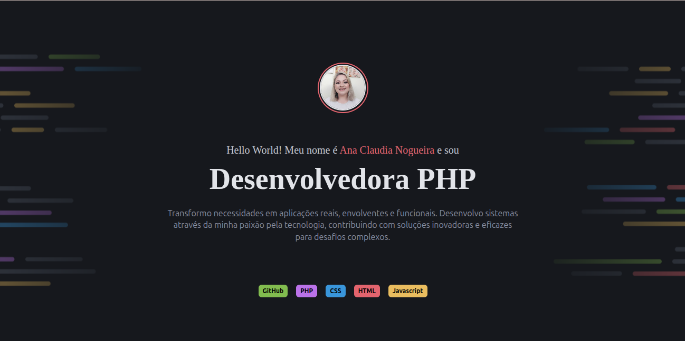

# 💼 Portfolio Dev - Desafio Rocketseat PHP

Este projeto é o **primeiro desafio** do Curso de Formação PHP da [Rocketseat](https://www.rocketseat.com.br/).  
Um portfólio pessoal simples, construído em **PHP puro** com **Tailwind CSS**, focado em exibir seus projetos e formas de contato.



---

## 🚀 Como rodar localmente

```bash
# Clone este repositório
git clone https://github.com/anacnogueira/portfolio-dev-php-rocketseat.git

# Acesse a pasta do projeto
cd portfolio-dev-php-rocketseat

# Inicie o projeto através do docker
docker-compose up -d
```

Depois, abra o navegador em:  
👉 [http://localhost](http://localhost)

---

## 🧰 Tecnologias usadas

- **PHP 8.5**
- **Tailwind CSS**
- HTML5 + CSS3
- Docker
- Nginx

---

## 📁 Estrutura do projeto

```
root/
├── index.php
├── components/
│   ├── footer.php
│   ├── header.php
│   └── projects.php
├── img/
│   └── (imagens e ícones do site)
```

---

## 📸 Seções do portfólio

- ✨ Header - Sobre mim
- 🚀 Projetos (fícticios)
- 📬 Footer - Contato via redes sociais ou e-mail

---

## 📌 Observações

- Estilização moderna feita com **Tailwind CSS** para responsividade e visual profissional.

---

Feito com 💖 por [@anacnogueira] (https://github.com/anacnogueira)
